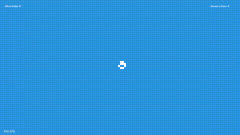

# Conway's Game of Life (Unity Edition)

A retro-inspired implementation of Conway's Game of Life using Unity. Built to introduce the topic  
to my kids. Improved it for the sake of keeping my skills on C# + Unity sharp.



## Features

- Cell simulation using Tilemaps  
- Custom patterns using ScriptableObjects  
- Pattern preview inside Unity Editor  
- Random pattern spawning with `R` key  
- Numeric modifiers (e.g. `3-R`, `5-C-P-R`) for bulk spawning  
- Toggleable runtime grid overlay with `G` key  
- Pixel Perfect Camera setup for crisp visuals  
- Dead cells outside camera view (screen-culling mode)  
- Live FPS and cell counter  
- Colorful Patterns  
- Wrap around toggle  

## Controls

| Key Combo       | Action                                                                 |
|----------------|------------------------------------------------------------------------|
| `R`            | Spawn a new pattern randomly                                           |
| `G`            | Toggle grid overlay                                                   |
| `C`            | Use a random color for the next pattern only                          |
| `W`            | Toggle wrap around mode                                               |
| `P`            | Use a random pattern from the library                                 |
| `V`            | Toggle UI elements (planned)                                          |
| `5-R`          | Spawn 5 default-color patterns randomly                               |
| `2-C-R`        | Spawn 2 random-colored patterns (next only)                           |
| `5-C-P-R`      | Spawn 5 random-colored, random-pattern instances                      |

> You can chain keys: a number modifier (`2`) applies to the next `R`, and keys like `C`, `P` act as flags.

## Folder Structure

```
Assets/
├── Fonts/            # Google Fonts (e.g. Pixelify Sans)
├── Patterns/         # ScriptableObject assets for patterns
├── Prefabs/
├── Scripts/
│   ├── GameManager.cs
│   ├── GridLines.cs
|   ├── InputManager.cs 
│   └── Pattern.cs        # ScriptableObject definition
│   ├── UIManager.cs
├── Editor/
│   └── PatternEditor.cs  # Inspector preview for patterns
```

## Patterns

Patterns are stored as `ScriptableObject` assets and support live preview in the Unity Inspector.

You can easily create new patterns or import classic ones like:
- Glider  
- R-pentomino  
- Diehard  
- Blinker  
- Penta-decathlon  
- 1-2-3
- Spaceship
- TBD

## Grid Overlay

A `GridLineDrawer` component dynamically draws grid lines to match the camera view using `LineRenderer`. Toggle it on/off at runtime with the `G` key.

## Requirements

- Unity 6  
- TextMeshPro  
- Pixel Perfect Camera component  

## TODO / Ideas

- [ ] Choose which Pattern to spawn from a visual inventory  
- [ ] Better UI  
- [ ] Configuration menu to control colors  
- [ ] Toggle simulation state (pause/resume/seed)  
- [ ] Export/import custom pattern JSON  
- [ ] Cellular orbit detection UI feedback  

## Credits

Inspired by Conway's classic cellular automaton. RIP John Conway.
